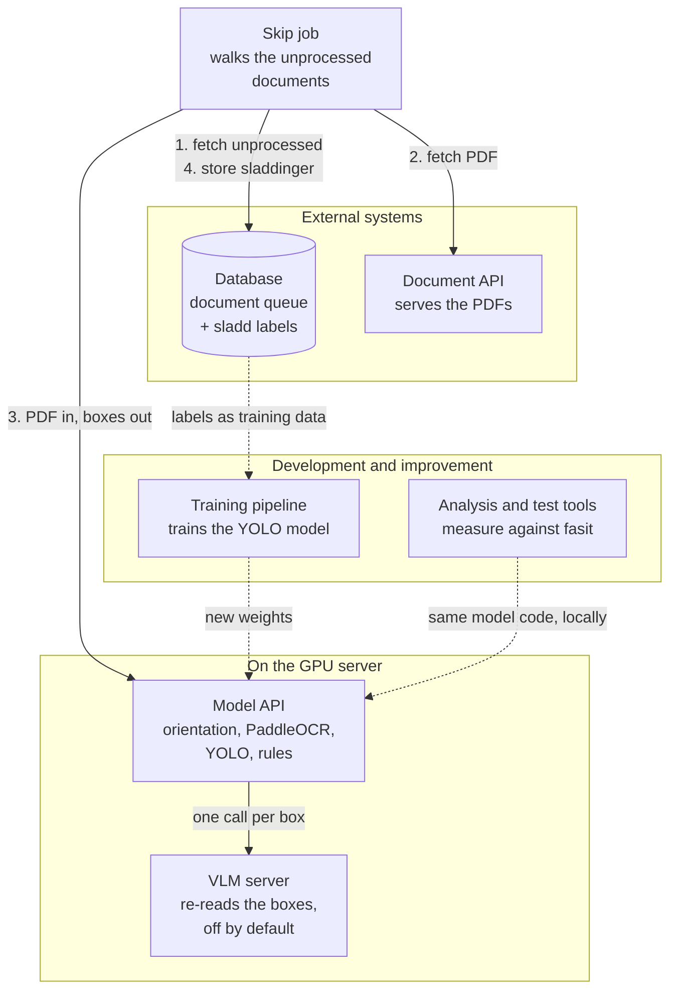
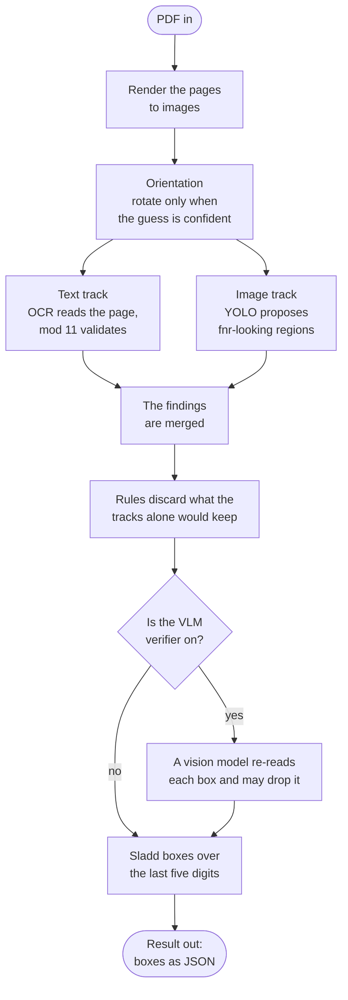
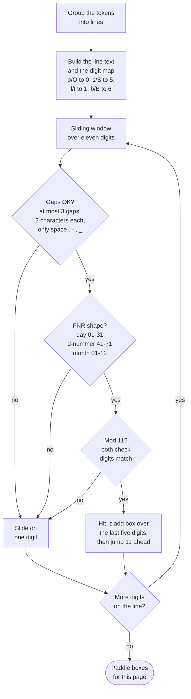
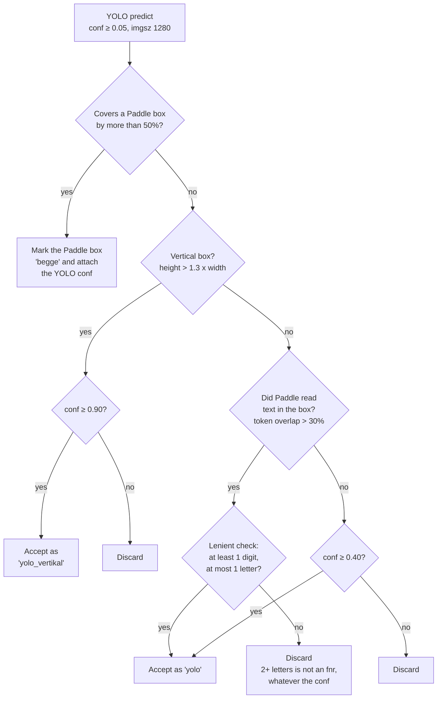
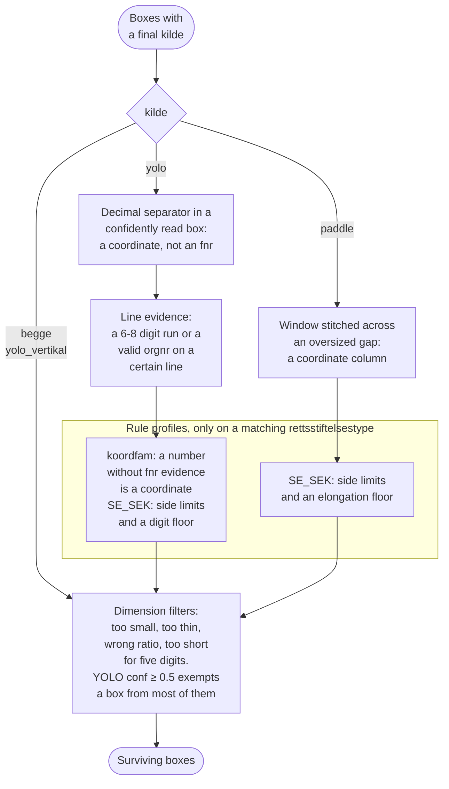

# Smart sladding: technical description

The solution has five parts: a batch job that drives the production flow, a
model API that does the analysis, an optional vision model that re-reads what
the API proposes, a set of analysis and test tools, and a training pipeline for
the image model.

**Figure 1:** Overall architecture. The batch job fetches unprocessed documents
from the database (1), downloads the PDF from the document API (2) and sends it
to the model API, which returns sladd boxes (3). The suggestions are stored in
the database as machine-generated sladdinger (4), so they can be told apart
from manual ones and overridden. The batch job contains no machine learning
itself; all the heavy work happens in the model API. The VLM server is a
separate process on the same host and is only called when the verifier is
turned on. The analysis tools and the training pipeline sit outside the
production flow and are used to measure and improve the model.

---

## Detection

Detection rests on two independent tracks. Every page is first rendered to an
image, then two methods look for fødselsnummer in parallel. The **text track**
has high precision because every hit can be checked mathematically. The **image
track** provides coverage where the OCR cannot read: handwriting, stamps, poor
scan quality. The findings are merged, put through a set of rules, and returned
as JSON.

**Figure 2:** Overall flow for sladding one document.

---

## The pipeline in detail

Each page is rendered at 300 DPI. An orientation model classifies whether the
page is the right way up (0, 90, 180 or 270 degrees), and the page is rotated
only if the model is confident enough (confidence ≥ 0.7); otherwise the
original orientation is kept. PaddleOCR then reads all the pages, eight at a
time, and returns word tokens with a position box and a read score each.

### Text track

The words are grouped into lines, and common OCR confusions are normalised
first (o/O → 0, s/S → 5, l/I → 1, b/B → 6). A sliding window then looks at
eleven digits at a time. A candidate is accepted only if three requirements
hold at once: the digits hang together, the first six form a valid date, and
both check digits pass the modulus 11 test. Random digit runs, phone numbers
and amounts very rarely get through.

**Figure 3:** The text track. The window slides one digit at a time until
something matches; a hit consumes the whole number.

### Image track and merge

YOLO proposes regions with a confidence per finding, which are then held up
against the text track. Elektronisk tinglyste documents skip YOLO entirely and
are handled by the text track alone. If a YOLO finding covers more than half of
an OCR-validated one, it counts as the same hit: the Paddle box is marked
`kilde: "begge"` and keeps the YOLO confidence. If it stands alone, the
requirement depends on context.

**Figure 4:** What happens to one YOLO box. The lenient check counts only
tokens that contain at least one digit, so a plain word in the box is ignored.

### Postfilters

The merge decides each box's `kilde`, and only then do the postfilters run.
Doing it in that order is what lets a box that became `begge` keep its
sladding. The rules themselves are predicates in `app/filter_rules.py` and
their operating points are the `RULE_*` blocks in `app/config.py`, so the same
rule runs in production and in the offline sweeps.

**Figure 5:** The postfilters. `utils/run.py --without-postfilter` turns the
whole set off, which measures what the rules contribute. Every threshold, and
the measurement behind it, is in `app/config.py`.

Two rule profiles apply only to specific rettsstiftelse types: `koordfam` for
maps and coordinate lists, `SE_SEK` for table-heavy seksjonering documents. The
codes the batch job sends enable them, and a document that arrives without
codes gets the global behaviour, so missing metadata can never cost recall.

### The verifier

If the VLM verifier is on, it runs after the postfilters and before the
coordinates are converted back. A vision model re-reads every box in the
stratum and drops the ones it is sure hold no fødselsnummer. It can only
remove boxes; it never adds one and never moves one. Any failure, from a
timeout to an unparsable answer, keeps the box. The README describes the
stratum and the guards, and `docs/VLM-ISOLATION.md` covers what the model
server is allowed to reach.

### Output

For each surviving finding a sladd box covers the last five digits, the
personnummer part, so the date of birth stays readable while the identifying
part is hidden. If the page was rotated before analysis, the coordinates are
rotated back to the document's original orientation and converted from pixels
to PDF points.

---

Two things about the response are easy to get wrong. `yolo_conf` and
`paddle_rec_score` are separate on purpose: detection certainty and read
quality measure different things, and a good read says nothing about how
certain the detection is. And the `trekk` object on `kilde: "yolo"` boxes does
not affect the sladding. It holds digit and letter counts, read quality,
longest digit run, whether the line holds an eleven-digit run of valid
fødselsnummer shape, and whether the number has a decimal separator. It is
written to the result CSV so stricter variants of the content check can be
measured against fasit in `utils/filter_sweep.py` without rerunning the model.
See `app/box_features.py`.

---

## Further improvements

Some improvements were left unused, mostly because they need more GPU memory
than the available server had.

The simplest gain is throughput. The OCR engine supports high-performance
inference (HPI), already prepared in the code but turned off because it needs a
stronger card. For the same reason several configuration parameters are lower
than they should be, among them the input resolution to text detection and to
the image model, and the number of pages and text lines per batch. All of it
sits in `app/config.py`, so it can be turned up on stronger hardware without
code changes.
