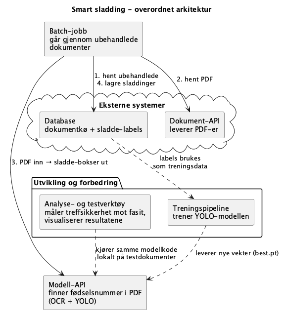
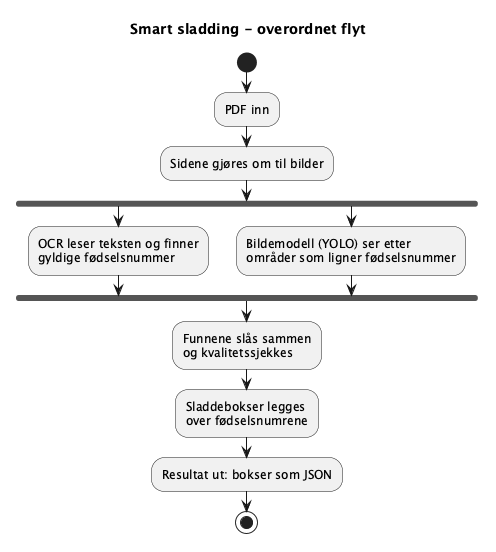
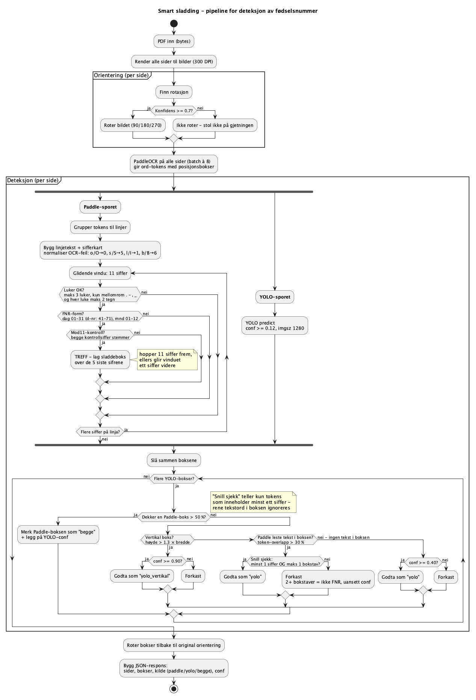

# Smart sladding: technical description

The solution has four parts: a batch job that drives the production flow, a
model API that does the analysis, a set of analysis and test tools, and a
training pipeline for the image model.

**Figure 1:** Overall architecture. The batch job fetches unprocessed documents
from the database (1), downloads the PDF from the document API (2) and sends it
to the model API, which returns sladd boxes (3). The suggestions are stored in
the database as machine-generated sladdinger (4), so they can be told apart
from manual ones and overridden. The batch job contains no machine learning
itself; all the heavy work happens in the model API. The analysis tools and the
training pipeline sit outside the production flow and are used to measure and
improve the model.

---

## Detection

Detection rests on two independent tracks. Every page is first rendered to an
image, then two methods look for fødselsnummer in parallel. The **text track**
has high precision because every hit can be checked mathematically. The **image
track** provides coverage where the OCR cannot read: handwriting, stamps, poor
scan quality. The findings are merged and quality-checked before the boxes are
returned as JSON.

**Figure 2:** Overall flow for sladding one document.

---

Figure 3 shows the pipeline in detail, with the criteria that decide whether a
finding is accepted. Each page is rendered at 300 DPI. An orientation model
classifies whether the page is the right way up (0, 90, 180 or 270 degrees),
and the page is rotated only if the model is confident enough (confidence
≥ 0.7); otherwise the original orientation is kept.

**Text track.** PaddleOCR reads the page as individual words with positions.
The words are grouped into lines, and common OCR confusions are normalised
first (o/O → 0, s/S → 5, l/I → 1, b/B → 6). A sliding window then looks at
eleven digits at a time. A candidate is accepted only if three requirements
hold at once: the digits hang together (at most three gaps of up to two
characters, and only space or simple punctuation), the first six digits form a
valid date (including d-nummer, where 40 is added to the day), and both check
digits pass the modulus 11 test. Random digit runs, phone numbers and amounts
very rarely get through.

**Image track.** YOLO proposes regions with a confidence per finding, which are
then held up against the text track. If a YOLO finding mostly overlaps (more
than 50 %) an OCR-validated one, it counts as the same hit and is marked
`kilde: "begge"`. If it stands alone, the requirement depends on context:

- OCR read text in the region: a content check. At least one digit and at most
  one letter, since two or more letters rule out a fødselsnummer no matter how
  confident the model is.
- OCR read nothing there: confidence of at least 0.40.
- Vertical regions (upright text), which the OCR normally does not read:
  confidence of at least 0.90.

**Postfilters.** After the merge, when each box's `kilde` is final, a set of
rules discards findings the tracks alone would have kept: a decimal separator
in confidently read text means a coordinate, not a fnr; a confidently read line
holding a 6-8 digit run or a valid orgnr proves the same; a paddle window
stitched across an oversized gap comes from a coordinate column. Two rule
profiles apply only to specific rettsstiftelse types: `koordfam` for maps and
coordinate lists, `SE_SEK` for table-heavy seksjonering documents. The codes
the batch job sends enable them. Finally, dimension filters remove boxes too
small or too oddly shaped to hold five digits. Every threshold, and the
measurement behind it, is in `app/config.py`; `utils/run.py
--without-postfilter` turns the whole set off to measure what the rules
contribute.

For each accepted finding a sladd box is computed over the last five digits,
the personnummer part, so the date of birth stays readable while the
identifying part is hidden. If the page was rotated before analysis, the
coordinates are rotated back to the document's original orientation.

**Figure 3:** The detection pipeline in detail.

---

Two things about the response are easy to get wrong. `yolo_conf` and
`paddle_rec_score` are separate on purpose: detection certainty and read
quality measure different things, and a good read says nothing about how
certain the detection is. And the `trekk` object on `kilde: "yolo"` boxes does not affect the sladding.
It holds digit and letter counts, read quality, longest digit run, whether the
line holds an eleven-digit run of valid fødselsnummer shape, and whether the
number has a decimal separator. It is written to the result
CSV so stricter variants of the content check can be measured against fasit in
`utils/filter_sweep.py` without rerunning the model. See `app/box_features.py`.

---

## Further improvements

Some improvements were left unused, mostly because they need more GPU memory
than the available server had.

The simplest gain is throughput. The OCR engine supports high-performance
inference (HPI), already prepared in the code but turned off because it needs a
stronger card. For the same reason several configuration parameters are lower
than they should be, among them the input resolution to text detection and to
the image model, and the number of pages and text lines per batch. All of it
sits in `app/config.py`, so it can be turned up on stronger hardware without
code changes.
